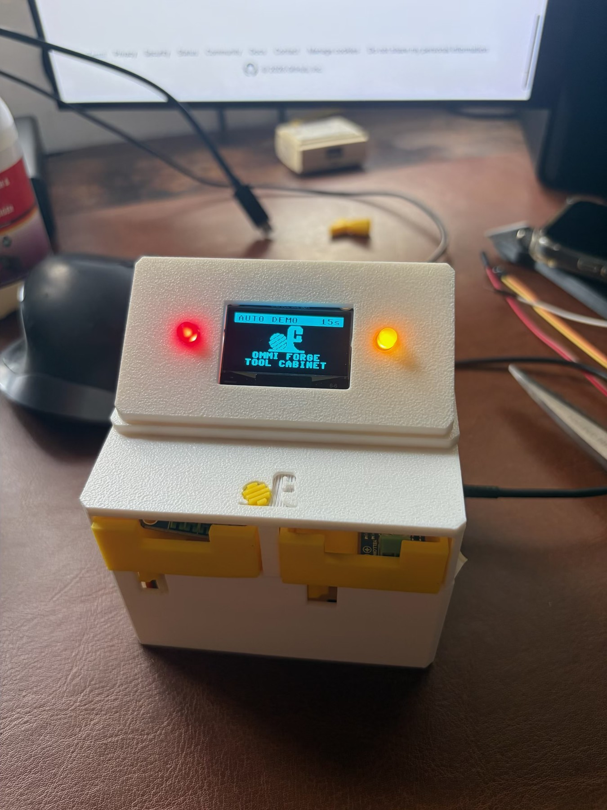

<h1 align="center">shopkeeper — the display pod</h1>

<p align="center">
  A 1.3″ SH1106 and two status lamps, on a tilted pod that sits on the lid of the
  <a href="https://github.com/Piyushmishra29/shopkeeper/tree/main">shopkeeper</a> tool crib.<br>
  <b>The lid does not change. Not one cut.</b>
</p>

<p align="center">
  
  
  
  
  
  
</p>

<p align="center">
  
  
  
  
</p>

<p align="center">
  
  <br>
  <sub><b>Built and running.</b> Screen on the case centreline, a lamp either side —
  each one directly above the Ø5 hole that registers the pod.</sub>
</p>

---

Everything registers on three features the top face already had. Two Ø5.00
holes and a 26 × 10 window, drawn a generation ago as "provision" for an OLED
and two LEDs that firmware 1.0.0 never drove:

```
        y = 45.88  ────●──────────┌──────────────┐──────────●────
                   x=20 Ø5.00     │  26.00×10.00  │      x=72 Ø5.00
                                  │  centre 46.00 │
                    └──────── 52.00 between hole centres ────────┘
```

Two spigots into the two holes, harness through the window. No latch, no
screws into the lid, no magnets — located exactly the way the lid itself is
located, on pins and gravity.

Every one of those three numbers was read back off the exported mesh rather
than trusted from the source. That is the theme of this whole branch.

---

## The machine, before and after

```
    z 94.8  ┌────────────────────┐   pod, 28.8 mm       ← this branch
            │  screen + 2 lamps  │   92 x 42.5 footprint
    z 66.0  ├────────────────────┤   ─────────────────
            │  top face: window, │   case_upper, 24 mm
            │  2x Ø5, deboss     │
    z 42.0  ├────────────────────┤
            │  bay: 2 drawers    │
    z 39.5  ├────────────────────┤
            │  mech bay, ESP32   │   case_lower
    z  0.0  └────────────────────┘
                   92 × 74 mm
```

| | |
|---|---|
| Pod | 92 × 42.5 × 28.8 mm, 30° tilt |
| `mount_base` | 92 × 42.5 × 5.0 — **14.0 g** |
| `mount_body` | 88 × 39.5 × 28.8 — **19.6 g** |
| Screen aperture | 35.0 × 23.7, one opening |
| Lamps | 2 × Ø5, at x 20 and x 72 — each above its own spigot |
| Machine height | 66.0 → **94.8 mm** |

---

# The problems, in the order they were found

This is the useful part of the branch. Almost none of the work was drawing a
wedge; nearly all of it was discovering that something already drawn was
wrong, usually by building a check that could catch it.

## 1. The lid's LED holes cannot hold LEDs

The very first measurement killed the obvious design. Two Ø5 holes sit in the
top face, so the obvious move is to push 5 mm LEDs into them. You cannot.

A 5 mm LED body is **8.6 mm long**. Pushed up from below with its dome flush
in the plate it hangs from z 64 down to **z 55.9** — through the drawer top at
z 60.2, and through the anti-tip rib whose crown is at z 62.2. A 3 mm LED
still fouls the rib. Even an SMD pad glued to the underside leaves 0.5 mm to a
rib that sweeps 26.7 mm underneath it, twice per transaction.

Those holes were drawn as provision and never checked against the bay they
open into. So the lamps moved onto the pod's face, where depth is free, and
the holes were promoted to what they are actually good for: **registration**.

## 2. Four millimetres, and one of them moves

The whole design is governed by a single dimension:

```
  z 66  ─── top face ────────────────  window + 2× Ø5 holes
  z 64  ─── ceiling underside ──────
              ↕  3.8 mm              ← everything must live here
  z 62.2 ─ ─ anti-tip rib crown ─ ─    and this surface MOVES
  z 60.2 ─── drawer top ────────────   26.7 mm of travel
```

Nothing may protrude past the ceiling at x 20 or x 72, because both sit
directly over a drawer. The spigots are therefore **exactly 2.0 mm** — the
plate thickness — and stop flush.

An independent check of the lid later corrected two of my numbers here: the
drawer is assembled at `DECK+0.2`, not `DECK`, so the real clearance is
**3.80 mm, not 4.00**, and the rib crown is at 62.20. It also found the only
band no drawer ever crosses is **x 42.00–49.00**, wider than the 43–49 I had
assumed. None of it changed the design — the spigots stop at the ceiling
either way — but wrong numbers in a file are wrong numbers.

## 3. There is no orientation that prints a one-piece pod

A pod is a wedge: flat bottom that mates the lid, one tilted face carrying the
screen.

- **Face-down** puts the lid-mating surface at 30° to the bed. It prints as a
  stepped slope, and it is the surface that has to sit flat.
- **Base-down** stands the whole plate on two 2 mm spigots and points every
  internal feature into the bed.

So the pod is **two parts**, and each gets a perfect orientation:

```
  mount_base (white)               mount_body (yellow)
  prints SPIGOT-SIDE UP            prints FACE-DOWN

     ▲ spigots                      ┌──────────────┐
  ┌──┴───────────────┐              │   bezel on   │
  │  92 × 42.5 × 5.0 │              │   the bed    │
  └──────────────────┘              └──────────────┘
  every downward feature            the aperture forms against
  becomes an upward one             the bed — the same trick
  zero overhangs                    case_upper uses for its logo
```

Splitting by function is the same move `servo_shim` makes elsewhere in this
project: isolate the thing that has to be right, so getting it wrong costs
grams instead of hours.

## 4. A bore normal to a tilted face travels sideways

This one was caught by eye, in a render, after twenty automated checks passed.

The lamp barrels are drilled along the face normal. At 30°, a bore gains
**0.5 mm of y for every 1 mm of depth**. Drawn 30 mm deep, the top lamp's
barrel exited **through the rear wall at y 66.98, z 3.62** — a circular bore
through a flat wall at an angle, which renders as an ellipse. The lower two
bored out through the bottom.

The part was still watertight. Still one body. Still support-free. Still
holed.

The fix was two lines. The lesson was a new check: **4900 rays fired at the
rear wall**, every one of which must land on it except inside the deliberate
cable notch. An audit later verified that check catches a **Ø0.6 mm** bore —
far finer than the 5 mm it was written for.

## 5. The body was hollowed 41 mm from where it belonged

To let the layout use absolute case coordinates, the face-local frame's origin
was moved to x 0. The hollowing cut still assumed it was centred, so it
hollowed **x −41.5 … 41.5** instead of **4.5 … 87.5**. Half the body stayed
solid.

Nothing looked wrong. It showed up only as 686 mm² of phantom overhang, and
the mass told the real story: **42.9 g → 21.6 g** once fixed.

## 6. Face-parallel boxes lean backwards as they go deeper

Same trigonometry as the bore, different victim. The cut that cleared space
behind the PCB reached **y 68.7 by z 3** — past the back of a part that ends
at 65.98 — and took the rear wall with it, leaving an 88.7 mm² shelf hanging
in the air.

Then the PCB pocket did it again: its deep rear corner landed at **y 62.67
against a wall at y 62.00**, opening the back of the body.

Two rules came out of this, and both are enforced in the code:

- **Every internal cut is bounded by a vertical wall envelope.** Walls are
  vertical; the cuts that make them have to be too.
- **The body's depth is derived from the module, not chosen** — and the module
  is shifted forward by exactly the lean, so front and rear margins come out
  equal. Balancing on the deep corner alone is the obvious mistake, and it
  left the front margin at 0.25 mm.

## 7. The calipers were wrong, and the drawing was right

The module's dimensions were measured by hand. Then the manufacturer's
dimensioned drawing turned up — corroborated by LCDWIKI's and by Pololu's,
the latter drawn independently off a physical unit. All three agree to the
hundredth of a millimetre, and every chain in the drawing closes exactly:

```
  inset 2.50 all round:  35.40 − 5.00 = 30.40,  33.50 − 5.00 = 28.50
  active area vertical:   7.35 + 14.70 + 11.45 = 33.50
  glass:                  5.25 + 23.00 +  5.25 = 33.50
```

| | Calipered | Drawing | Cost if printed |
|---|---|---|---|
| Corner holes | 4.0 | **Ø3.00 (M3)** | a Ø3.9 peg **cannot enter** |
| Hole pitch | assumed 29.0 × 27.5 | **30.40 × 28.50** | out by 1.4 and 1.0 mm |
| Board width | 35.0 | **35.40** | — |
| Board thickness | 1.6 | **1.20** | — |
| Active area | assumed centred | **2.05 mm toward the header** | window clips the picture |

The 4.0 mm reading was the **Ø4.50 copper annulus** around a Ø3.00 hole — an
easy thing for calipers to span. The 33.50 reading was exact.

The active-area offset is the quiet one. The glass *is* centred; the offset is
inside the panel, where the driver IC and the FPC bond eat the bottom 6.20 mm.
A symmetric window clips the picture **at the top** — which is where a status
line goes.

## 8. Two of the checks could never fail

An adversarial audit swept every free constant across 0.3×–2.2× and tilt from
5° to 60°, **200,000 randomised parameter sets**: zero failures, worst
residual 4.6e−14 mm. Float noise.

`module margins balanced front to rear` was testing an identity that `BODY_D`
had been *solved* to satisfy. `module stays inside all four walls` reported
2.433 mm every time, by construction. Both certified their own algebra.

Worse: the entire face-layout section — eleven checks — **touched no mesh at
all.** It was arithmetic on the same constants the geometry was built from. It
would not have noticed if the geometry failed to build.

They are all now replaced by one boolean:

```python
mod = module_solid()          # board with its four holes, glass,
                              # connector, FPC fold — as a solid
ov  = inter([mount_body, mod])
chk("module + connector + FPC clear the body", ov.volume < 0.5, ...)
```

It found the connector fouling the rear wall by **48.284 mm³** on its first
run.

## 9. A straight Dupont does not fit, and never did

The pod was designed around a claim in its own comments — 19.7 mm of depth
behind an up-slope header. Measured against the real geometry: **4.80 mm**,
and 7.40 mm a millimetre further in.

The *conclusion* survived (up-slope is still 2–3× better than down-slope), but
the margin was fiction. A 4-way Dupont housing is ~14.7 mm; even a bare 0.1″
male header is ~8.5 mm. Making the pod swallow one needs either a deeper pod
or a hole out of the back — and a hole out of the back is what it briefly had.

**So the module is wired one of the two ways that measurably do fit:** wires
soldered straight to the pads, or a right-angle header exiting down the slope.

## 10. The shop rule, written down once

A printed peg going into a printed hole moves the wrong way **twice**: the
hole comes out ~0.25 mm small, the peg ~0.15 mm large.

That rule was already documented in this project — and then not applied to the
pod's own joint pins, which were drawn at Ø3.0 into Ø3.3 and would have
printed as a **−0.10 mm interference fit** on two pins 68 mm apart. It is now
a pair of constants and two functions that every peg-in-hole derives from:

```python
HOLE_SHRINK, PEG_GROW = 0.25, 0.15
def slip(peg_d, want=0.15):  return peg_d + PEG_GROW + HOLE_SHRINK + want
def bore(part_d, want=0.15): return part_d + HOLE_SHRINK + want   # bought parts
```

The same rule condemned the LED bores: a Ø6.0 counterbore prints ~5.75 against
a Ø5.8 flange, so **the flange could not enter**. The counterbore and its cone
are gone; the flange now seats flat on the wall's inner face, which is a real
datum rather than a taper three LEDs wedge into at three different depths.

## 11. Knife edges, phantom ledges, and things that taper to nothing

A blind verification of the exported meshes found **946 sub-0.8 mm
cross-section regions**, 879 of them under 0.4 mm — a slicer emits none of it.
The bulk was two joint pads tapering from 0.28 mm to **exactly zero** over
10.9 mm. Triangles became trapezoids with a 0.8 mm minimum, and the sub-0.4
area fell **531 → 66 mm²**, with `mount_base` going completely clean.

The remainder turned out to be measurement artefacts, and proving that
mattered as much as fixing the real ones: erode-then-dilate rounds off convex
corners, and the last layer of any sloped surface is inherently a sliver. The
decisive test is whether a region **vanishes** under erosion, not how much
area it loses.

Two coplanar cylinders butted exactly also produced a 7.2 mm² boolean seam
that read as a down-facing ledge. They now overlap by 0.2 mm — because a check
you have to explain away is no check.

## 12. What is still broken, and it is not in this part

**There is no route from the pod to the ESP32.**

`deck()` is a solid plate. Ray-casting 1800 points straight down through the
pod's wire slot, **not one** reaches past the deck in the only drawer-free
band. The 210 that do get through elsewhere land in drawer 2's drive-fin slot,
where the rack sweeps 31.4 mm.

It needs a Ø5 cable hole in the deck at x 43–49 — clear of both rack slots,
both pinion bores and all three alignment pins. The last check in
`display_mount.py` **fails on purpose** and should keep failing until that
exists:

```
[FAIL] harness can reach the ESP32 below the deck
       300/1800 rays clear the deck, 0 of those in the drawer-free band x 42-49
       <-- THE DECK NEEDS A CABLE HOLE AT x 43-49
```

---

## What the checks actually do now

53 pass, 1 fails. They are most of the file, because the checks were wrong
first.

| Group | What it interrogates |
|---|---|
| Geometry | watertight, single body, per part |
| Does it fit the case | boolean interference against the **real** `case_upper.stl`; hole centres read off the mesh; 1600 rays proving the lid's top face is flat under the whole footprint |
| Does the module go in | one boolean against a solid model of the board, glass, connector and FPC fold |
| Face layout | apertures, shoulders, peg roots, press fits — via the shop rule |
| Nothing bores out | the bore **rim**, not its axis; 4900 rays at the rear wall; a boolean per lamp per boss |
| Can it print | overhang area by ray cast, bed contact, in the true print pose |
| Can it be wired | 1800 rays through the deck — **currently failing** |

---

## Print it

| Plate | Objects | Mass |
|---|---|---|
| `nano/mount/plate_gauges.3mf` | `gauge_spigot`, `gauge_screen` | 3.2 g + 18.7 g |
| `nano/mount/plate_mount.3mf` | `mount_base`, `mount_body` | 14.0 g + 19.6 g |

`assembly_mount.3mf` is the lid with the pod on it — for looking at, not for
printing.

**Supports off.** Both parts measure 0.0 / 1.4 mm² unsupported by ray cast,
and **0.000 mm²** by a slicer-accurate layer-vs-layer test. If your slicer
proposes supports, something has regressed.

### Print the gauges first

Two numbers are reasoned, not measured, and no amount of arithmetic settles a
printed peg in a printed hole:

- **`gauge_spigot`** — 3.2 g, six minutes. Four pegs at 4.40 / 4.55 / 4.70 /
  4.85, notched 1–4 so you can count them by fingernail. Try them in the
  printed lid; the winner goes in `SPIG_D`.
- **`gauge_screen`** — three peg diameters at the drawing's pitch. Drop the
  module on each tile; the winner goes in `PEG_D`. Loose on all three means
  your board's holes are not Ø3.00 and the drawings do not describe it.

### Assembly order

1. Gauges first. Settle `SPIG_D` and `PEG_D`.
2. **Wire the module before it goes in.** There is no access afterwards.
   Soldered leads or a right-angle header, and **the header edge faces up the
   slope.**
3. Body face-down on the bench, lamps still empty — they stand proud, and the
   body will not lie flat once they are in.
4. Module in through the mouth, swing face-parallel, push onto four pegs.
5. Lamps from inside.
6. Harness down through the baseplate slot; body onto the base's two pins;
   invert; two M2 from below.
7. Harness through the lid window; pod onto its spigots.
8. Connect to the ESP32 — **this step does not exist yet.** See §12.

---

## Known limitations

- **Retention is friction on four pegs with 1.2 mm of grip each**, on a face
  that looks up at 60°. Most of the board's weight pulls it off its seat.
- **Removing the module will probably break a peg** — roughly 12 N of pry.
- **Nothing prevents fitting the module 180° out.** The picture is not clipped
  either way; it just sits 4.1 mm low and upside down until the SH1106 remap
  bits are set.
- **No legend on the lamps.** Nothing on the face says which is which.

---

## Run it

```sh
cd cad && python display_mount.py
```

Needs `numpy`, `trimesh`, `manifold3d`, `shapely`. It regenerates every mesh
and plate and gates the build on the checks above.

| | |
|---|---|
| `cad/display_mount.py` | the whole design — constants, geometry, checks |
| `nano/mount/` | generated meshes, print plates, print-pose copies |
| `docs/display/` | this photo |

The cabinet itself — drawers, rack and pinion, firmware, the commercial
argument — lives on [`main`](https://github.com/Piyushmishra29/shopkeeper/tree/main).

MIT.
